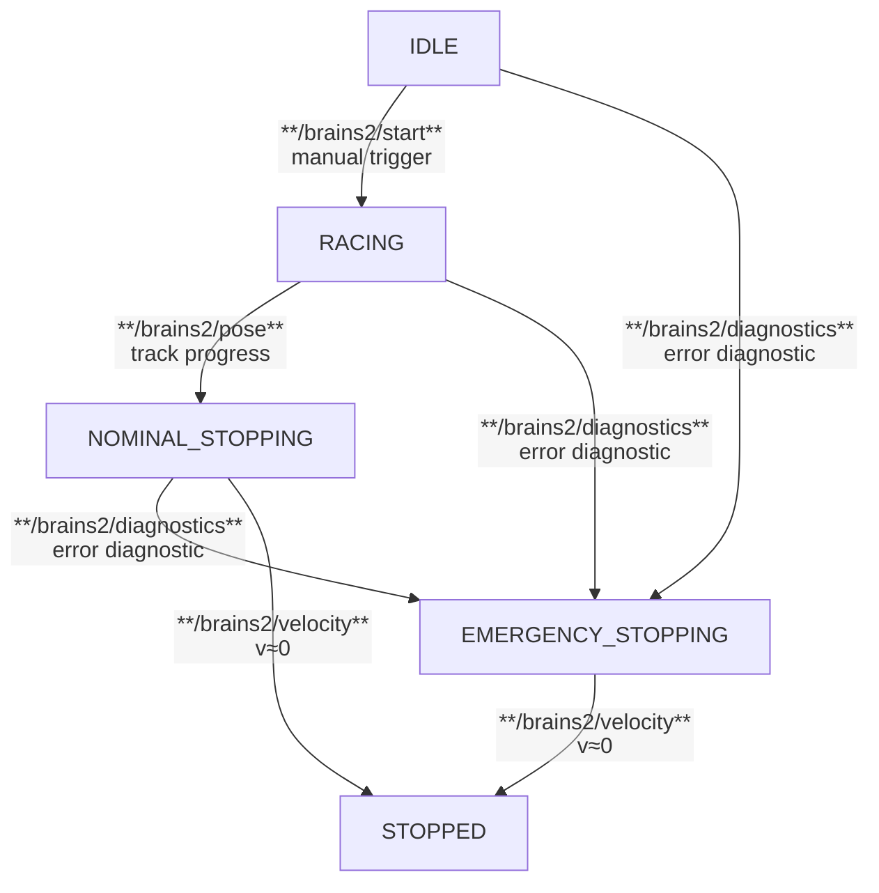

# Coordination 

The goal of the node is to keep track of the outputs of every other module and create a global FSM summarized in the following diagram:

The FSM state is published periodically every 10ms and at every state transition to be sure that the system reacts as quickly as possible.

The logic of the transition `RACING -> NOMINAL_STOPPING` is quite simple and leverages a global representation of the track with _a consistent track progress variable $s$_.
We keep track of the current track progress $s^\mathrm{proj}$ at every new pose message, and increment a lap counter whenever we pass a certain threshold (that should be slightly beyond 6m). 
To avoid spurious lap count increments because of pose measurement noise (which could in the worst cases "jump rope" with the finish line), we also enforce that 1s occurs between every increment.

Leveraging the track progress instead of the orange cones lets us reuse the same logic in v0 (where we don't have any node to detect these cones) and following versions (where the SLAM node will be responsible of it). 
It poses a hard constraint on the SLAM concept that needs to be able to support loop closure, and the TE concept that needs to accordingly update the track representation once the loop closure is detected.