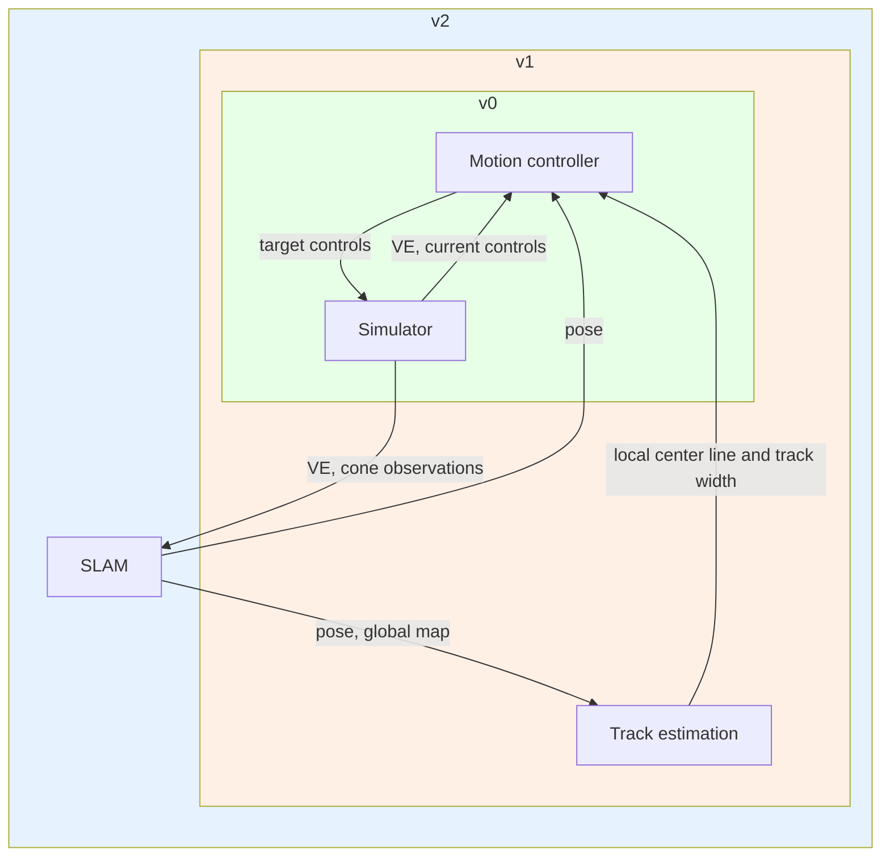

```mermaid
flowchart BT
    MC["Motion controller"]
    S["Simulator"]
    SL["SLAM"]
    TE["Track estimation"]

    S -- VE, current controls --> MC
    MC -- target controls --> S
    TE -- local center line and track width --> MC


    subgraph v0["v0"]
        MC
        S
    end
        S -- VE, cone observations --> SL
    subgraph v1["v1"]
        v0
        TE
    end
    subgraph v2["v2"]
        v1
        SL
        SL -- pose, global map --> TE
        SL -- pose --> MC
    end

    style v0 fill:#e6ffe6
    style v1 fill:#fff0e6
    style v2 fill:#e6f3ff
```
https://excalidraw.com/#room=46bb8b19556439c2c457,IS54EafZ9U6sbUTKxftHZw